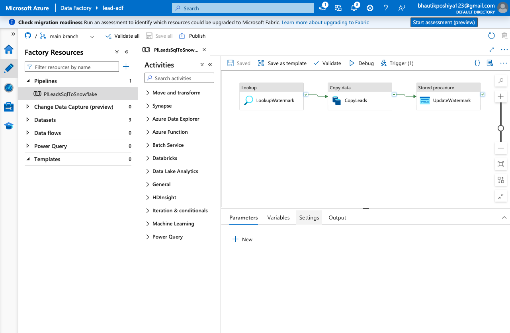
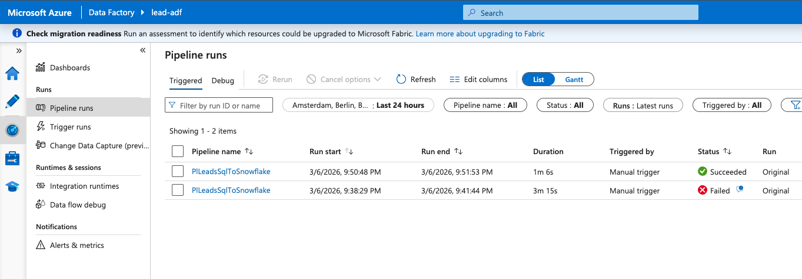
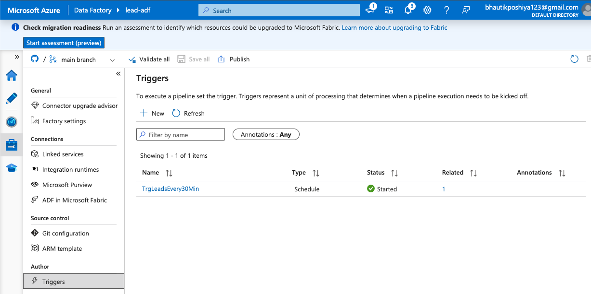
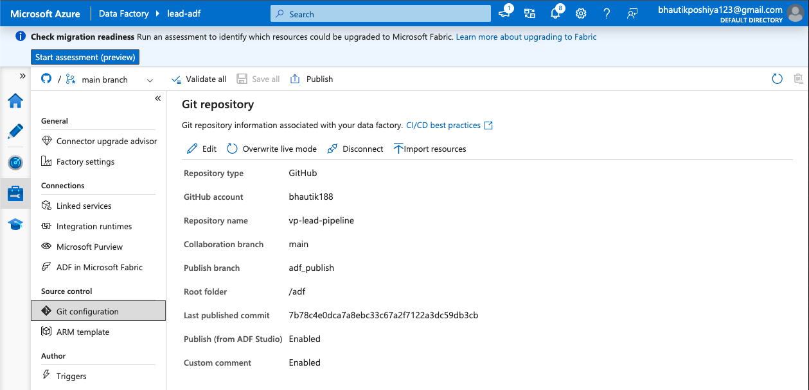
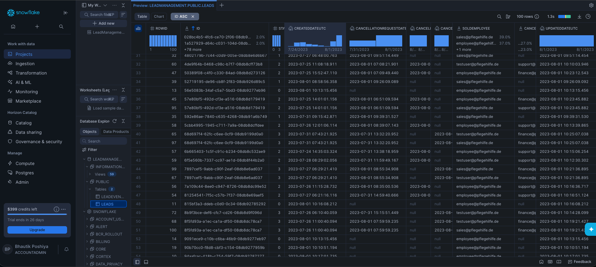
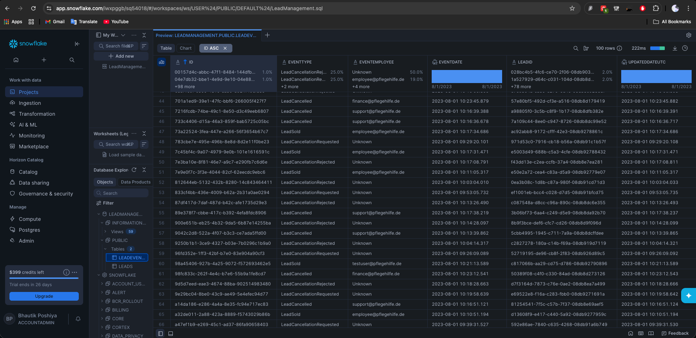

# Screenshots — Data Engineering Task

Visual proof of pipeline implementation.

---

## Step 2 — Azure Data Factory

**Pipeline design** — Lookup watermark → Copy Leads → Update watermark (incremental load)

**Pipeline run** — Successful execution

**Trigger** — Schedule every 30 minutes (task requirement)

**GitHub integration** — Repo connected (task requirement)

---

## Step 3 — Snowflake

**LEADS table** — Data synced from SQL via ADF

---

## Step 4 — Python Transformation

**LeadEvents table** — Transformed from Leads (event types per state)

